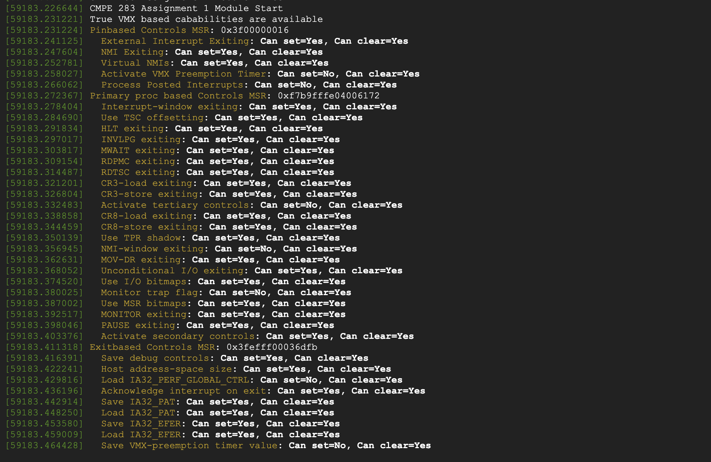
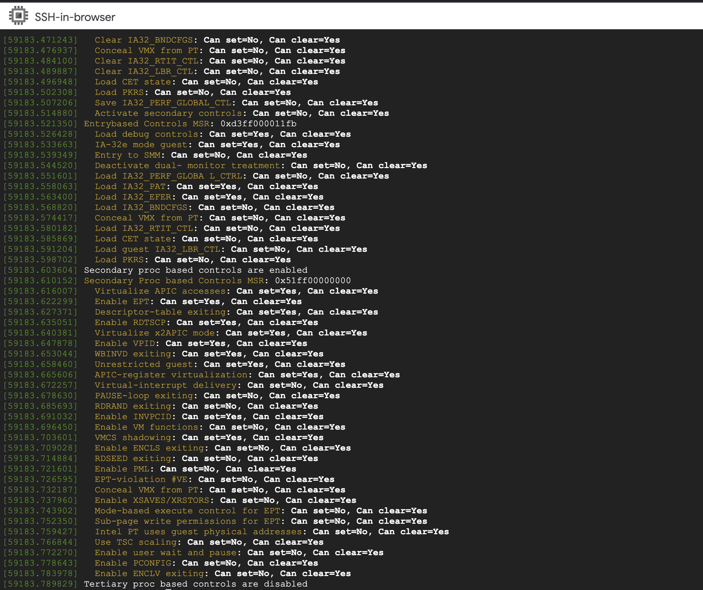

## Steps to execute

Create an account on Google Cloud and enable `Compute Engine`. In the `Compute Engine` section, go to VM templates 
and create a VM template. Select a suitable flavor of VM and a Linux distribution of Linux and select `Create`

Using the command:

```shell
gcloud compute instances create instance-1 --project=<> --zone=us-central1-a --machine-type=n2-standard-2 
--network-interface=network-tier=PREMIUM,subnet=default --maintenance-policy=MIGRATE --provisioning-model=STANDARD 
--service-account=<> --scopes=https://www.googleapis.com/auth/devstorage.read_only,https://www.googleapis.com/auth/logging.write,https://www.googleapis.com/auth/monitoring.write,https://www.googleapis.com/auth/servicecontrol,https://www.googleapis.com/auth/service.management.readonly,https://www.googleapis.com/auth/trace.append 
--create-disk=auto-delete=yes,boot=yes,device-name=instance-1,image=projects/debian-cloud/global/images/debian-11-bullseye-v20220920,mode=rw,size=10,type=projects/virtualization-366918/zones/us-central1-a/diskTypes/pd-balanced 
--no-shielded-secure-boot --shielded-vtpm --shielded-integrity-monitoring --reservation-affinity=any 
--enable-nested-virtualization
```

create a VM.

Login to the VM using the browser based SSH and run the following commands:


```shell
sudo su
cd
mkdir homework-1
cd homework-1
#Copy the .c and the Makefile into the directory

apt-get install build-essential
apt-get install linux-headers-$(uname -r)

make
```

On running this command all the required artifacts would get built and we can try to load the module into the kernel 
using:

```shell
insmod ./cmpe283-1.ko
```

To view the output of the module loading use:

```shell
dmesg
```

To remove the module from the kernel use:

```shell
rmmod ./cmpe283-1.ko
```
## Output



